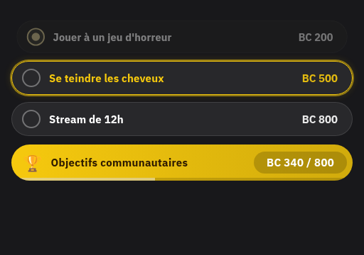
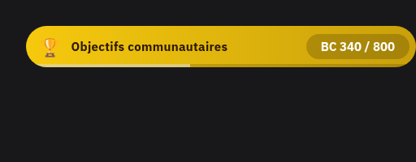

# Twitch Goal Widget

A streamlined OBS browser source overlay for tracking community goals and donations via Streamlabs. Features two widget variants, a live config editor, and animations for new contributions.

## Previews

### Full widget — `/widget`
Goals list + progress bar with real-time donation and sub tracking.



### Bar only — `/bar`
Compact single-bar variant, perfect for a bottom-of-screen overlay.



---

## Usage

### 1. Configure

Open `/` (the config page) in your browser and fill in your settings:

| Field | Description |
|---|---|
| **Streamlabs token** | Your Streamlabs socket API token |
| **Starting amount** | Pre-seed the counter (e.g. carry over from a previous stream) |
| **Sub value** | Amount added per subscription (default: 5) |
| **Goals** | Label + threshold pairs, sorted by threshold |
| **Currency** | Label shown next to amounts (default: `BC`) |
| **Accent colour** | Primary colour for the bar and highlights |
| **Border radius** | Corner roundness (0 = square, 50 = pill) |
| **Font size** | Text size in px |
| **Widget width** | Width in px |
| **Row spacing** | Gap between goal rows (full widget only) |
| **Scale** | Global size multiplier (e.g. `1.5` = 50% larger) |
| **Theme** | Dark or light |

Copy the generated URL and paste it into your OBS browser source.

### 2. Add to OBS

- **Full widget** → `https://your-domain/widget?config=<token>`
- **Bar only** → `https://your-domain/bar?config=<token>`

Set the browser source width to match your **Widget width × Scale**.

### 3. Reset the counter

Append `?reset` to the URL to clear the persisted amount and restart from **Starting amount**:

```
https://your-domain/widget?config=<token>&reset
```

---

## Animations

- **Goal reached** — confetti burst + "Merci !" bubble (full widget)
- **Near goal (80 %)** — pulsing glow on the goal row
- **New contribution** — floating `+X BC` pill and a bounce on the counter

---

## Self-hosting

```bash
docker build -t twitch-widget .
docker run -p 80:80 twitch-widget
```

The config page is then available at `http://localhost/`.
